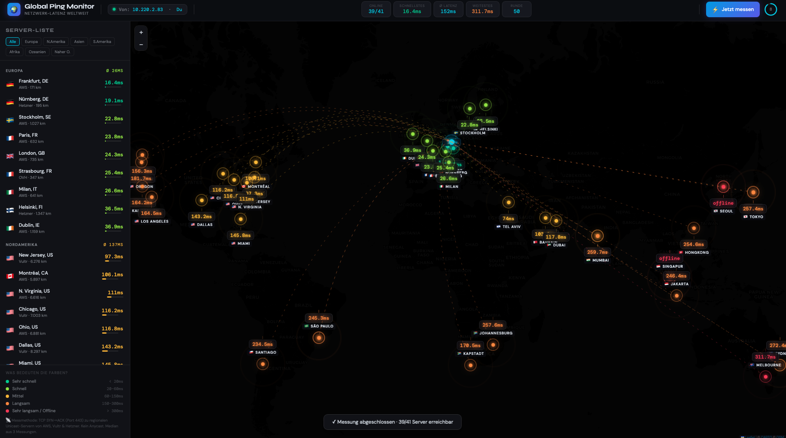

# 🌍 pingmap

[](https://www.python.org/)
[](LICENSE)
[](#requirements)
[](#-deploy-on-aws-lightsail-always-on-public-url)
[](#-server-coverage)
[](#why-tcp-instead-of-icmp-ping)

**Visualize your network latency to servers around the world — live, in your browser.**

---

🌍 **Live Demo:** [https://pingmap.tjks.org](https://pingmap.tjks.org)

---

pingmap measures how long your data packets take to travel from your machine to 40+ servers across every continent. It runs a local web server and displays an interactive world map with real-time results.



---

## ✨ Features

- **Real latency measurements** — TCP SYN/ACK timing (identical to ICMP ping, no `sudo` needed)
- **40+ servers** across 8 regions: Europe, North America, Asia, South America, Africa, Middle East, Oceania
- **No Anycast tricks** — all targets are geographically fixed unicast endpoints (AWS S3 regional, Vultr, Hetzner)
- **Live updating** — auto-refreshes every 10 seconds
- **Interactive map** — Leaflet.js with zoom, pan, animated arc lines
- **Sidebar with full server list** — sorted by latency, filterable by continent
- **Zero dependencies** — pure Python stdlib, no `pip install` needed

---

## 🚀 Quick Start

```bash
git clone https://github.com/tjk-solutions-de/pingmap.git
cd pingmap
python3 ping_map.py
```

Your browser opens automatically. That's it.

---

## ⚙️ Options

```bash
python3 ping_map.py                    # default: port 8765, 10s interval, 3 pings/target
python3 ping_map.py --interval 15      # measure every 15 seconds
python3 ping_map.py --count 5          # 5 pings per target (more accurate median)
python3 ping_map.py --port 9000        # use a different port
```

| Flag | Default | Description |
|------|---------|-------------|
| `--port` | `8765` | Local web server port |
| `--interval` | `10` | Seconds between measurement rounds |
| `--count` | `3` | Pings per target (median is used) |

---

## 🔬 How it works

### Why TCP instead of ICMP ping?

Classic `ping` uses ICMP Echo packets which require raw socket access (`sudo` on Linux/macOS). Instead, pingmap uses **TCP SYN timing**:

1. Open a TCP connection to port 443 on the target server
2. Measure time until SYN-ACK is received
3. Close the connection

The result is **identical to ICMP RTT** — it measures the same network round-trip time, just using TCP instead of ICMP.

### Why not ping `1.1.1.1` or `8.8.8.8`?

Those are **Anycast** addresses — the same IP exists on hundreds of servers worldwide. Your router automatically routes you to the *nearest* one. So from Berlin, Tokyo, and New York, `1.1.1.1` all respond in ~2ms from a local node. **That tells you nothing about global latency.**

pingmap uses **Unicast regional endpoints** instead:

| Provider | Example endpoint | Why it works |
|----------|-----------------|--------------|
| **AWS S3** | `s3.ap-northeast-1.amazonaws.com` | Resolves to a single Tokyo datacenter IP |
| **Vultr** | `hnd-jp-ping.vultr.com` | Dedicated ping host per location |
| **Hetzner** | `nbg1-speed.hetzner.com` | Fixed Nuremberg datacenter |
| **OVH** | `proof.ovh.net` | Strasbourg datacenter |

### Architecture

```
┌─────────────────────────────────────────────────┐
│  ping_map.py (Python)                           │
│                                                 │
│  ┌─────────────┐    ┌──────────────────────┐   │
│  │  Measurement │    │   HTTP Server        │   │
│  │  Engine      │    │   localhost:8765     │   │
│  │              │    │                      │   │
│  │  TCP SYN/ACK │───▶│  GET /          HTML │   │
│  │  parallel    │    │  GET /api/state JSON │   │
│  │  threads     │    │  GET /api/measure    │   │
│  └─────────────┘    └──────────────────────┘   │
└─────────────────────────────────────────────────┘
          ▲                        │
          │ poll every 600ms       │ serve
          │                        ▼
┌─────────────────────────────────────────────────┐
│  Browser (Leaflet.js map)                       │
│                                                 │
│  • CartoDB Dark Matter tiles                    │
│  • Animated SVG arc lines                       │
│  • Live marker updates as results arrive        │
│  • Sidebar sorted by latency                    │
└─────────────────────────────────────────────────┘
```

---

## 🌐 Server coverage

| Continent | Servers | Providers |
|-----------|---------|-----------|
| 🌍 Europe | 9 | AWS, Hetzner, OVH |
| 🌎 North America | 11 | AWS, Vultr |
| 🌏 Asia | 9 | AWS, Vultr |
| 🌎 South America | 3 | AWS, Vultr |
| 🌍 Africa | 2 | AWS, Vultr |
| 🌏 Middle East | 3 | AWS, Vultr |
| 🌏 Oceania | 3 | AWS, Vultr |

---

## 📊 Reading the results

| Color | Range | Meaning |
|-------|-------|---------|
| 🟢 Green | < 20ms | Same country / nearby datacenter |
| 🟡 Lime | 20–60ms | Same continent |
| 🟡 Amber | 60–150ms | Intercontinental |
| 🟠 Orange | 150–300ms | Far away |
| 🔴 Red | > 300ms | Very far / packet loss |

**Typical values from Central Europe:**
- Frankfurt: 5–15ms
- London/Paris: 15–30ms
- US East Coast: 80–110ms
- US West Coast: 130–160ms
- Tokyo: 220–260ms
- Sydney: 280–320ms

---

## ☁️ Deploy on AWS Lightsail (always-on, public URL)

Run pingmap 24/7 so anyone can access it via a public IP.

**Cost:** Free for 90 days, then **$5/month** (includes IPv4 address fee).

### 1. Create instance

Go to [lightsail.aws.amazon.com](https://lightsail.aws.amazon.com) → **Create instance**

| Field | Value |
|-------|-------|
| Region | Frankfurt (eu-central-1) |
| OS | Ubuntu 24.04 LTS |
| Plan | $3.50/mo |
| Name | `pingmap` |

### 2. Open port 8765

Lightsail → your instance → **Networking** tab → **Add rule** → TCP `8765` → Save

### 3. Connect & install

Click **"Connect"** in the Lightsail dashboard (opens browser terminal), then:

```bash
git clone https://github.com/tjk-solutions-de/pingmap.git
cd pingmap
```

### 4. Run as a background service

```bash
sudo nano /etc/systemd/system/pingmap.service
```

Paste this:

```ini
[Unit]
Description=Global Ping Monitor
After=network.target

[Service]
User=ubuntu
WorkingDirectory=/home/ubuntu/pingmap
ExecStart=/usr/bin/python3 /home/ubuntu/pingmap/ping_map.py --interval 60 --port 8765
Restart=always
RestartSec=5

[Install]
WantedBy=multi-user.target
```

```bash
sudo systemctl daemon-reload
sudo systemctl enable pingmap
sudo systemctl start pingmap

# Check it's running
sudo systemctl status pingmap
```

### 5. Open in browser

```
http://YOUR_LIGHTSAIL_IP:8765
```

Your public IP is shown in the Lightsail dashboard.

### Update after code changes

```bash
cd ~/pingmap
git pull
sudo systemctl restart pingmap
```

---

## 🛠 Requirements

- Python 3.6+
- No external packages needed (uses only stdlib: `socket`, `threading`, `http.server`, `json`)
- Internet connection
- Browser (opens automatically)

---

## 🔧 Known Network Issues
 
### TH Wildau (eduroam) — Site not reachable
 
The eduroam network at TH Wildau uses a custom DNS server (`193.175.213.170`) that does not resolve external domains like `pingmap.tjks.org`. The site itself is fully reachable — only DNS resolution fails.
 
**Fix on macOS:**
 
```bash
# Set DNS to Google (fixes it immediately)
sudo networksetup -setdnsservers Wi-Fi 8.8.8.8 8.8.4.4
 
# Revert when done
sudo networksetup -setdnsservers Wi-Fi "Empty"
```
 
Or permanently via **System Settings → Wi-Fi → eduroam → Details → DNS** → add `8.8.8.8` and `8.8.4.4` at the top.
 
**Fix on Windows:**
 
1. **Start → Settings → Network & Internet → Wi-Fi → eduroam → Edit DNS**
2. Set IPv4 DNS to:
   - Preferred: `8.8.8.8`
   - Alternate: `8.8.4.4`
3. Save → reload the page
 
Or via PowerShell (Admin):
```powershell
# Find your Wi-Fi adapter name
Get-NetAdapter | Where-Object {$_.Status -eq "Up"}
 
# Set DNS (replace "Wi-Fi" with your adapter name if different)
Set-DnsClientServerAddress -InterfaceAlias "Wi-Fi" -ServerAddresses "8.8.8.8","8.8.4.4"
 
# Revert
Set-DnsClientServerAddress -InterfaceAlias "Wi-Fi" -ResetServerAddresses
```
 
> This issue is specific to TH Wildau's eduroam DNS configuration and not related to pingmap. Mobile data and home networks work without any changes.

---

## 📄 License

MIT License — do whatever you want with it.

---

## 🤝 Contributing

Pull requests welcome! Ideas:

- [ ] Add more server locations
- [ ] Export results as CSV / JSON
- [ ] Historical latency graph per server
- [ ] Config file for custom targets
- [ ] `--lang en` flag for English UI